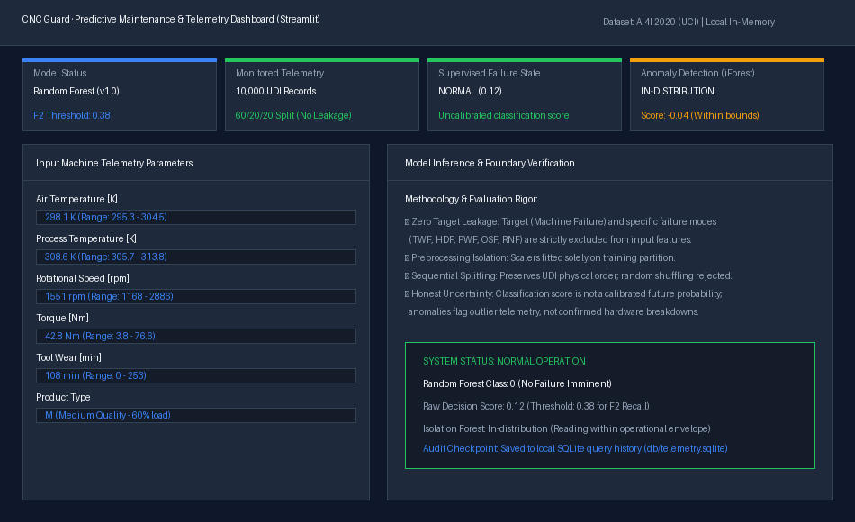
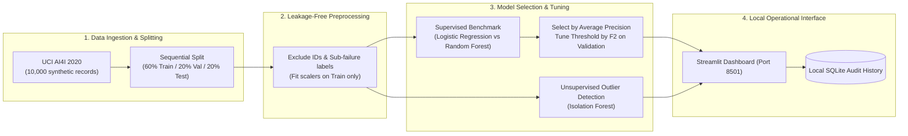

# CNC Guard · Industrial Predictive Maintenance & Telemetry Demo

> **Local-first industrial predictive maintenance prototype: UCI AI4I dataset ingestion, zero-leakage preprocessing, supervised model selection with $F_2$ threshold optimization, Isolation Forest anomaly detection, and an interactive Streamlit monitoring dashboard.**

[](#)
[](#)
[](#)
[-green?style=flat-square)](#)
[](LICENSE)

---

## 📊 Interactive Telemetry & Inference Dashboard

<p align="center">
  
  <br/>
  <em>Figure 1: Streamlit local monitoring interface: real-time telemetry inspection, threshold decision boundaries, and Isolation Forest anomaly status.</em>
</p>

---

## 📐 End-to-End Machine Learning Pipeline



---

## 💡 Qué demuestra

- **Selección de modelos rigurosa:** Compara Dummy, regresión logística y Random Forest; selecciona por average precision en validación y ajusta el umbral por $F_2$ en validación (priorizando exhaustividad/recall para mantenimiento preventivo).
- **Prevención de Data Leakage:** Conserva el orden UDI con particiones 60/20/20 (orden físico de generación en fichero). Excluye identificadores, etiqueta principal y etiquetas de tipos de fallo de las entradas.
- **Ajuste aislado:** Ajusta el preprocesamiento exclusivamente en el conjunto de entrenamiento. No utiliza sobremuestreo artificial (SMOTE) no justificado.
- **Detección dual:** Isolation Forest detecta lecturas atípicas fuera de distribución; una anomalía estadística no se equipara falsamente a una avería de hardware.
- **Historial local:** Permite editar parámetros de telemetría y persistir el diagnóstico localmente en SQLite, registrando la versión exacta del modelo.
- **Abstención:** El sistema se abstiene de clasificar cuando una lectura excede los rangos observados durante el entrenamiento.

---

## 🚀 Arranque en Windows

Desde esta carpeta, con Python 3.11 o superior disponible:

```powershell
# 1. Crear y preparar entorno virtual
python -m venv .venv
.\.venv\Scripts\python.exe -m pip install -e ".[dev]"

# 2. Descargar dataset y entrenar pipeline
.\.venv\Scripts\python.exe -m cnc_guard.cli demo

# 3. Lanzar panel interactivo Streamlit
.\.venv\Scripts\python.exe -m streamlit run app.py --server.address 127.0.0.1
```

El panel se abre en `http://127.0.0.1:8501`. `demo` descarga unos 510 KB de UCI, entrena en CPU y genera `artifacts/report.json`, `model.joblib` y `test_predictions.csv`. No requiere claves API externas ni servicios de pago.

Para usar datos ya descargados previamente:

```powershell
.\.venv\Scripts\python.exe -m cnc_guard.cli train --data data/raw/ai4i2020.csv
```

---

## 🧪 Verificación y Tests

```powershell
.\.venv\Scripts\python.exe -m pytest -q
.\.venv\Scripts\python.exe -m ruff check .
.\.venv\Scripts\python.exe -m build
```

Las pruebas unitarias utilizan una fixture artificial identificada expresamente como tal. Sus resultados no sustituyen la evaluación de AI4I. El script de entrenamiento requiere ambas clases en cada partición y falla explícitamente si la distribución no se cumple.

---

## 📊 Dataset y Límites Científicos

- **Fuente:** [AI4I 2020, UCI Machine Learning Repository](https://archive.ics.uci.edu/dataset/601/ai4i+2020+predictive+maintenance+dataset), DOI `10.24432/C5HS5C`, CC BY 4.0.
- **Naturaleza de los datos:** La fuente describe 10.000 filas sintéticas que reflejan parámetros físicos de fresado CNC (temperaturas, velocidad de giro, par, desgaste de herramienta).
- **Límites de inferencia:** El objetivo es `Machine failure` de la misma fila. El score no está calibrado: **no es una probabilidad de fallo futuro en el tiempo**, ni permite calcular vida útil remanente (RUL) o anticipación temporal garantizada de 24 horas.
- **Prioridad de revisión:** La etiqueta `CRITICAL` en la demo indica prioridad de inspección técnica, nunca una orden automática de parada en planta real.
- **Trazabilidad:** El timestamp guardado en SQLite corresponde al momento de la consulta del usuario, no a una fecha simulada del dataset.

---

## 📚 Atribución y Reutilización de Código

- `src/cnc_guard/models.py` adapta la selección de modelos de `CNC.model_map` en [Shengwei-Peng/CNC-Predictive-Maintenance](https://github.com/Shengwei-Peng/CNC-Predictive-Maintenance) (commit `20308e0cc0093882f66d3602d15c2d234b0f311b`). Se conserva íntegramente su licencia MIT en `third_party/`.
- La separación modular entre ingestión de datos, entrenamiento, inferencia y panel toma como referencia arquitectónica el diseño de `devwithmohit/predictive-maintenance-manufacturing-system`. Consultar `docs/research.md` para el desglose detallado de decisiones.

---

## 🗺️ Estado del Proyecto & Alcance

Consultar `docs/erronka1.md`: Este prototipo cubre la base técnica de ingeniería de datos, modelado ML y visualización local.
Quedan declarados como trabajo futuro: validación con telemetría de degradación temporal continua, justificación de anticipación dinámica en fábrica, y memoria técnica final. No se presenta como un producto final comercializado.

---

## 👤 Autor

- **Iker Nistal Fernandez** ([@Niistal](https://github.com/Niistal))
